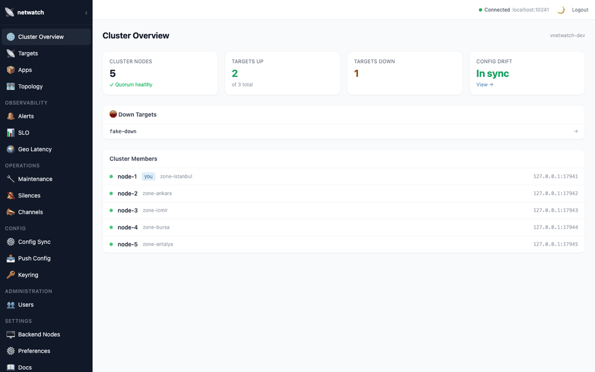

<div align="center">

# 🛰️ netwatch

### Self-hosted, distributed network monitoring with a web UI
**No cloud · no SaaS agents · no external database — just two binaries and a YAML file.**

[](LICENSE)
[](https://github.com/saidtaylan/netwatch/releases)
[](https://github.com/saidtaylan/netwatch/actions/workflows/ci.yml)
[](https://go.dev)
[](https://nuxt.com)
[](#contributing)

[**Features**](#features) · [**Why netwatch**](#the-problems-netwatch-solves-and-how) · [**Install**](#installation) · [**Configuration**](#configuration) · [**Architecture**](#architecture-overview)



</div>

> A live tour of a 5-node gossip cluster: healthy quorum and per-zone members, real-time target up/down state, dependency topology, SLO tracking, and per-region latency — all served from your own infrastructure, no external database required.

---

## ⚡ Quick start

### Full stack (backend + web UI) — Docker Compose

The fastest way to get **both** the agent and the dashboard running:

```bash
git clone https://github.com/saidtaylan/netwatch.git
cd netwatch/deploy
nano config.yaml          # set admin.setup_token (a starter config ships here)
docker compose up -d
```

- **Web UI** → http://localhost:8080 — on the connect screen, enter the backend URL `http://localhost:10240`, then create your admin user.
- **Backend** → http://localhost:10240/health

The compose file runs the backend image, downloads the prebuilt UI bundle from the release, and serves it with nginx — nothing is built locally. See [`deploy/docker-compose.yml`](deploy/docker-compose.yml).

### Backend only — one container

Just the agent (REST API + Prometheus metrics, **no UI**):

```bash
docker run -d --name netwatch -p 10240:10240 --cap-add NET_RAW \
  ghcr.io/saidtaylan/netwatch:latest
curl http://localhost:10240/health        # → OK
```

For a clustered, production deployment jump to **[Installation](#installation)** — systemd, Ansible, Docker, or Helm (all install the backend **and** the UI).

---

## 🤔 What is netwatch?

**netwatch** is a distributed network monitoring system you run on your own infrastructure. Each backend node is a single Go binary that continuously probes TCP, HTTP/HTTPS, ICMP ping, DNS, and SQL targets, then exposes results over a REST API. Multiple nodes form a leaderless gossip cluster — they share probe state in real time and coordinate to ensure every outage produces exactly one alert, never duplicates, no matter how many nodes are watching the same target.

The frontend is a Nuxt 3 single-page application served by nginx. It connects directly to any backend node in your cluster and gives you a live dashboard: target states, dependency graphs, SLO tracking, per-region latency, and cluster health — all in one place, with no external database required.

netwatch is designed for teams who want the power of Prometheus-level monitoring without the operational complexity of a full Prometheus + Alertmanager + Grafana stack. Everything ships as two binaries and a YAML file.

## ✨ Features

| Capability | Description |
|---|---|
| **Multi-protocol probes** | TCP, HTTP/HTTPS (status + body assertions), ICMP ping, DNS, SQL (MySQL / PostgreSQL / SQL Server / Oracle) |
| **Smart state machine** | Transient failures enter a *soft-down* retry phase; only after `max_retries` consecutive failures is the target declared *hard-down* and an alert sent |
| **Exactly-once alerting** | Consistent hashing assigns one responsible node per target — only that node sends the alert. Failover is automatic when the primary leaves the cluster |
| **Leaderless cluster** | Gossip-based (hashicorp/memberlist); no single point of failure, no elected leader, no ZooKeeper |
| **LWW conflict resolution** | Lamport sequence numbers on every state change; highest seq wins if two nodes disagree |
| **Distributed probe ownership** | Only `probe_replication_factor` nodes (default 3) probe each target — a 50-node cluster does not hammer targets 50× |
| **Dependency graph & root cause** | `depends_on` relationships between targets let the system report "checkout is down because db-primary is down" instead of alerting on every affected service |
| **Scope classification** | Every alert carries `REAL_OUTAGE` / `NETWORK_PARTITION` / `LOCAL_FAILURE` / `AMBIGUOUS` — you know immediately whether the service or your network is the problem |
| **SLO tracker** | Per-target uptime tracking with rolling windows (30d / 7d / 24h), error budget, and breach alerts |
| **Config drift detection** | Each node gossips its config hash; diverging nodes are immediately visible in the UI and via a Prometheus metric |
| **Quorum gating** | Alert dispatch is suppressed when the cluster loses quorum, preventing false positives from a split-brain node |
| **Geo latency view** | Per-region latency breakdown with anomaly detection — self-hosted multi-region synthetic monitoring |
| **Alert channels** | Shell script (`.sh` / `.ps1`), SMTP (HTML multipart), generic JSON webhook, Prometheus Alertmanager format |
| **App → target indirection** | Group targets under named apps with owner teams; `AFFECTED_APPS` and `OWNER_TEAMS` are injected into every alert |
| **Prometheus metrics** | `/metrics` endpoint with probe status, latency, SLO, cluster, and geo gauges |
| **Hot-reload** | `config.yaml` is re-read on a configurable interval — no restart required |
| **SQLite storage** | Single-binary, no external database — state and incidents persist across restarts |
| **Credentials injection** | `${VAR}` placeholders in config are resolved from a separate `credentials.env` file |
| **Windows Service** | Native Windows Service integration via `netwatch.exe service install/remove` |

---


## 🧠 The problems netwatch solves (and how)

Most monitoring tools work fine with one watcher and one target. The hard problems start when you put **many watchers** in front of **shared targets** across **multiple regions**. netwatch is built around those problems.

### 1. Many watchers must not turn into a DoS on the target

The naive way to get redundant monitoring is to have every node probe every target. In a 50-node cluster that means each database, API, and DNS server is hit **50 times per interval** — your monitoring system becomes an accidental denial-of-service attack on the very things it's supposed to protect, and a slow target gets pushed over the edge by health checks alone.

netwatch instead treats "who probes what" as a **distributed ownership problem**. For each target it deterministically selects only a small subset of nodes — `probe_replication_factor` of them (default 3) — using a consistent-hash ring. The selection is **zone/region-aware**: it spreads the chosen probers across different regions first, so a target is observed from several vantage points without every node piling on. The result is bounded, predictable load on the target (3 probes, not 50) while still getting multi-perspective detection. Operators can also pin sensitive targets to specific nodes (`probe_from`) — e.g. only the two nodes that actually have network access to a restricted VPN segment.

### 2. Many watchers must not turn into an alert storm

If 3 nodes all notice the database is down, you do **not** want 3 alerts (or 50). netwatch uses the same consistent-hash ring to elect exactly **one responsible node** per target; only that node dispatches the alert. If the responsible node leaves the cluster, the ring reassigns ownership automatically — no elected leader, no failover script. One outage → one alert, deterministically.

### 3. "Is it really down, or is it just *me*?"

A single node losing its uplink looks identical to a real outage if you only have one observer. Because netwatch probes from multiple nodes and shares results over gossip, it can compare what every node sees and **classify the scope** of each event:

- **REAL_OUTAGE** — every node that can vote sees it down → the service is genuinely down.
- **NETWORK_PARTITION** — some nodes see it up, some down → a network split, not a service failure.
- **LOCAL_FAILURE** — only the alerting node sees it down → probably that node's own connectivity.
- **AMBIGUOUS** — not enough data to decide yet.

Each alert carries this classification plus a confidence score and the exact list of nodes that voted up/down. You stop waking people at 3 a.m. because one probe node's switch hiccupped.

### 4. One root cause, not twenty symptoms

When a core database dies, every service that depends on it also fails. Most tools fire an alert for each one. netwatch lets you declare `depends_on` relationships, builds a dependency graph, and performs **root-cause analysis**: the alert for `checkout` says the root cause is `db-primary`, reports the dependency depth, and lists the full cascading impact. You get one meaningful page instead of a wall of noise — and this works **even when the failing dependency is probed by a different node**, because root cause is resolved against the gossip-merged, cluster-wide view of state.

### 5. A split-brain node must not cry wolf

If the cluster partitions and a node finds itself in the minority, its view of the world is untrustworthy. netwatch **gates alerting on quorum**: a node that has lost quorum enters an isolated mode and suppresses alert dispatch (and rejects config/state writes with HTTP 503) until it rejoins a healthy majority. Split-brain produces silence, not false alarms.

### 6. Restarts and rejoins must not produce phantom alerts

Probe state is persisted locally (SQLite, with a legacy `state.json` path) and carries Lamport sequence numbers. When a node restarts or rejoins, an **anti-entropy push-pull sync** reconciles its state with the cluster before it starts alerting, so a rolling restart of the whole fleet doesn't generate a storm of spurious recovery/outage alerts. Conflicts between nodes are resolved deterministically by last-writer-wins (highest Lamport seq, then timestamp, then node name).

### 7. No external database, no master, no babysitting

There is no Prometheus server, no Alertmanager, no etcd, no elected leader, and no shared SQL database to keep alive. Every node is a single self-contained Go binary with its own embedded SQLite file; the cluster is leaderless gossip (hashicorp/memberlist). Dynamic configuration (targets, SLOs, channels, silences, users) is replicated across the cluster over gossip with LWW conflict resolution, so you can edit it through the UI on any node and it converges everywhere. The frontend is static files behind nginx — no Node.js runtime in production.

### 8. Multi-region synthetic monitoring without a SaaS

Because probers are region-tagged, netwatch records per-region latency for each target and flags **latency anomalies** (one region suddenly 3× slower than the others, above a 5 ms floor to ignore sub-millisecond jitter). You get the "is the API slow from Europe but fine from US-East?" answer that you'd normally pay a synthetic-monitoring SaaS for — from your own nodes.

---

## 🏗️ Architecture Overview

```
┌──────────────────────────────────────────────────────────┐
│  Browser                                                  │
│  Nuxt 3 SPA — served by nginx as static files            │
│  Connects to any backend node over HTTP                   │
└────────────────────────┬─────────────────────────────────┘
                         │ REST API (port 10240)
          ┌──────────────┼──────────────┐
          ▼              ▼              ▼
   ┌─────────────┐ ┌─────────────┐ ┌─────────────┐
   │  Backend    │ │  Backend    │ │  Backend    │
   │  node-1     │ │  node-2     │ │  node-3     │
   │  Go binary  │ │  Go binary  │ │  Go binary  │
   │  port 10240 │ │  port 10240 │ │  port 10240 │
   └──────┬──────┘ └──────┬──────┘ └──────┬──────┘
          │               │               │
          └───────────────┴───────────────┘
              gossip cluster (port 7946 UDP+TCP)
```

Each backend node:
- Runs its own probe loop independently
- Shares probe state via gossip with all peers
- Stores state in a local SQLite file — no shared database
- Exposes the full API (fleet view, SLO, topology, etc.)

The frontend can connect to **any** backend node — they all serve the same cluster-wide view.

---

## 📋 Requirements

| Component | Requirement |
|---|---|
| **OS (production)** | Linux with systemd (Ubuntu 20.04+, Debian 11+, RHEL 8+) |
| **OS (development)** | macOS or Windows |
| **Go** | 1.22+ (only needed to build from source) |
| **Node.js** | 20+ with pnpm (build-time only — runtime is static files) |
| **nginx** | Any recent version (frontend static file serving) |
| **Firewall** | Port `10240` (API) and `7946` TCP+UDP (gossip) open between nodes |

> **ICMP ping probes** require `CAP_NET_RAW` on Linux. The systemd unit file enables this automatically. On macOS/Windows, ping probes require running as root/Administrator.

---

## 🚀 Installation

### Option A — systemd (Recommended for Linux)

The fastest path for a single node or small cluster on Linux. **Nothing is compiled** — `install.sh` downloads the prebuilt backend binary (arch-matched) and frontend bundle from the [Releases page](https://github.com/saidtaylan/netwatch/releases).

#### 1. Get the repo (for the install script + unit files) and install nginx

```bash
git clone https://github.com/saidtaylan/netwatch.git
cd netwatch
sudo apt-get install -y nginx     # or: sudo dnf install -y nginx
```

#### 2. Run the install script

```bash
cd deploy-systemd
sudo ./install.sh                 # installs the latest release
# Pin a version:        sudo ./install.sh --version v0.1.3
# Use a local build:    sudo ./install.sh --from-source   (needs make build-linux + pnpm build)
```

This script:
- Creates a `netwatch` system user
- **Downloads** the arch-matched binary (`netwatch-linux-amd64`/`-arm64`) to `/usr/local/bin/netwatch`
- **Downloads** the UI bundle (`netwatch-frontend.tar.gz`) to `/opt/netwatch-ui` and configures an nginx site (port 80) — no Node.js runtime
- Copies a minimal runnable `config.yaml` to `/etc/netwatch/config.yaml` (boots out of the box; full reference is `backend/config.example.yaml`)
- Installs and starts `netwatch-backend.service` + `netwatch.target`

#### 3. Edit the config

```bash
sudo nano /etc/netwatch/config.yaml      # set admin.setup_token, add targets / cluster
```

See [Configuration](#configuration) for the key fields to set.

#### 4. Restart and verify

```bash
sudo systemctl restart netwatch-backend
sudo systemctl status netwatch.target
curl http://localhost:10240/health       # → OK
```

---

### Option B — Manual (Custom setup)

#### Linux (systemd, step-by-step)

**Backend** — download the prebuilt binary from the release:
```bash
# Pick your arch: amd64 or arm64
ARCH=amd64
sudo curl -fSL -o /usr/local/bin/netwatch \
  https://github.com/saidtaylan/netwatch/releases/latest/download/netwatch-linux-$ARCH
sudo chmod 755 /usr/local/bin/netwatch

sudo mkdir -p /etc/netwatch /var/lib/netwatch
# Minimal runnable starter (full reference: backend/config.example.yaml):
sudo cp backend/config.skeleton.yaml /etc/netwatch/config.yaml
sudo nano /etc/netwatch/config.yaml   # set admin.setup_token, add targets/cluster

# Install and start service
sudo cp deploy-systemd/netwatch-backend.service /etc/systemd/system/
sudo systemctl daemon-reload
sudo systemctl enable --now netwatch-backend
```

> Prefer to build it yourself? `cd backend && make build-linux [GOARCH=arm64]` then `sudo install -m 755 bin/netwatch-linux-* /usr/local/bin/netwatch`.

**Frontend** — download the prebuilt static bundle from the release:
```bash
sudo mkdir -p /var/www/netwatch
curl -fSL https://github.com/saidtaylan/netwatch/releases/latest/download/netwatch-frontend.tar.gz \
  | sudo tar -xz -C /var/www/netwatch

# nginx — serve the SPA (all routes → index.html)
# Add a server block like:
#   root /var/www/netwatch;
#   location / { try_files $uri $uri/ /index.html; }
sudo nginx -t && sudo systemctl reload nginx
```

> Prefer to build it yourself? `cd frontend && pnpm install && pnpm build`, then copy `.output/public/.` into the web root.

---

#### macOS (development only)

> **Note:** macOS is not supported for production. ICMP ping probes require root, and there is no systemd. Use macOS for local development and testing only.

**Backend:**
```bash
cd backend
go run ./cmd/linux/   # or: go build -o netwatch ./cmd/linux/ && ./netwatch
```

**Frontend:**
```bash
cd frontend
pnpm install
pnpm dev   # dev server at http://localhost:3000
```

---

#### Windows

> **Note:** ICMP ping probes require Administrator privileges on Windows.

**Backend:**
```powershell
# Build
cd backend
$env:GOOS="windows"; $env:GOARCH="amd64"; go build -o netwatch.exe ./cmd/windows/

# Install as Windows Service (Administrator PowerShell)
.\netwatch.exe service install --config C:\netwatch\config.yaml
sc.exe start netwatch

# Remove
sc.exe stop netwatch
.\netwatch.exe service remove
```

**Frontend:**
```powershell
cd frontend
pnpm install
pnpm build
# Serve .output/public/ with IIS, nginx for Windows, or any static file server
```

---

#### Docker

**Full stack (backend + UI)** — use the Compose file (see the [Quick start](#-quick-start)):

```bash
cd deploy
nano config.yaml            # set admin.setup_token
docker compose up -d        # backend :10240, UI :8080
```

**Backend container only** (no UI):

```bash
docker run -d \
  --name netwatch \
  -p 10240:10240 \
  -p 7946:7946 \
  -v /etc/netwatch/config.yaml:/etc/netwatch/config.yaml:ro \
  -v netwatch-state:/var/lib/netwatch \
  --cap-add NET_RAW \
  ghcr.io/saidtaylan/netwatch:latest
```

To serve the UI alongside this container, run an nginx container over the
released `netwatch-frontend.tar.gz` bundle — exactly what `deploy/docker-compose.yml`'s
`ui` / `ui-init` services do.

> `--cap-add NET_RAW` is required for ICMP ping probes. Remove it if you don't use `type: ping` targets.

#### Kubernetes (Helm)

A DaemonSet Helm chart ships under [`backend/helm/netwatch`](backend/helm/netwatch). It runs one agent per node with `hostNetwork: true` (so gossip and ICMP work), a headless service for peer discovery, and the keyring as a Secret.

> The chart deploys the **backend** only. Serve the web UI separately — host the released `netwatch-frontend.tar.gz` bundle on any static host / nginx Ingress (the same static files the Docker `ui` service and the systemd installer use), pointed at any backend node's `:10240`.

```bash
# Render to review, then install
helm template nw backend/helm/netwatch -f my-values.yaml
helm install   nw backend/helm/netwatch -f my-values.yaml
```

Put your probe targets, cluster settings, and keyring in a values file (see [`values.yaml`](backend/helm/netwatch/values.yaml) for every option):

```yaml
image:
  repository: ghcr.io/saidtaylan/netwatch
  tag: latest

keyring:
  - "base64-encoded-AES-256-key=="   # same on every node

config: |
  node_alias: "netwatch-agent"
  port: "10240"
  cluster:
    enabled: true
    bind_port: 7946
  targets:
    - name: example-tcp
      type: tcp
      target: "10.0.0.5:5432"
```

> The chart name is not hard-coded into resource names — they derive from the release name and `nameOverride`, so you can rename the project freely (`helm install <release> ... --set nameOverride=<newname>`).

---

## 🔑 First Login

1. Open your browser and navigate to `http://<frontend-ip>` (or `http://localhost:3000` in dev mode).
2. You'll be prompted to enter the **backend node URL** — e.g. `http://192.168.1.10:10240`. The frontend stores this in the browser and connects directly.
3. Go to the **`/setup`** page (linked from the login screen on first run).
4. Enter the `setup_token` from your `config.yaml` (the `admin.setup_token` field).
5. Create your **admin username and password**.
6. That's it — log in with your new credentials. The setup page is only usable once.

> The `setup_token` is a one-time bootstrap secret. After the admin account is created, it has no further effect.

---

## ⚙️ Configuration

Key fields in `/etc/netwatch/config.yaml`:

```yaml
# ── Identity ──────────────────────────────────────────────────────────────────
app_name: "netwatch"         # appears in metrics labels and alert env vars
port:     "10240"            # HTTP API port

# ── Auth ──────────────────────────────────────────────────────────────────────
admin:
  setup_token: "change-me"  # one-time bootstrap token → used on /setup page

# ── Storage ───────────────────────────────────────────────────────────────────
state_file: "/var/lib/netwatch/state.json"

# ── Probe timing ──────────────────────────────────────────────────────────────
probe_interval_sec:  60      # how often each target is probed
retry_interval_sec:  30      # wait between retries after a failure
max_retries:         3       # failures before hard-down (and alert)
timeout:             5       # per-probe timeout in seconds
reload_interval_sec: 30      # config hot-reload interval (0 = disabled)

# ── Credentials ───────────────────────────────────────────────────────────────
credentials_file: "/etc/netwatch/credentials.env"  # ${VAR} source

# ── Notifications ─────────────────────────────────────────────────────────────
notifications:
  ops-webhook:
    type: webhook
    parameters:
      url: "https://hooks.example.com/netwatch"
      format: "generic"      # or "alertmanager"

  ops-mail:
    type: mail
    parameters:
      smtp_host: "smtp.corp.local"
      smtp_port: "587"
      from:      "netwatch@corp.local"
      to:        "sre@corp.local"
      tls_mode:  "starttls"

default_notify: ["ops-webhook"]

# ── Targets ───────────────────────────────────────────────────────────────────
targets:
  - name: "payments-db"
    type: tcp
    target: "db.prod:5432"

  - name: "payment-api"
    type: http
    target: "https://api.payments.prod/health"
    options:
      expected_status:
        in: [200, 204]
      body_contains: '"status":"ok"'
    depends_on: ["payments-db"]

  - name: "office-gateway"
    type: ping
    target: "10.0.0.1"
```

For a full annotated reference of all supported fields and probe types, see [`backend/config.example.yaml`](backend/config.example.yaml).

---

## 🌐 Multi-Node Cluster

All nodes run the same binary and the same basic config structure. Add a `cluster:` block to each node's `config.yaml`:

```yaml
cluster:
  enabled:             true
  node_name:           "node-1"          # unique per node
  bind_port:           7946
  advertise_addr:      "192.168.1.101"   # this node's IP, reachable by peers
  peers:
    - "192.168.1.102:7946"
    - "192.168.1.103:7946"
  keyring:
    - "c2VjcmV0a2V5MzJieXRlc2xvbmdoZXJlISE="  # base64 AES key, same on all nodes
  expected_node_count: 3
  min_quorum_ratio:    0.5               # suppress alerts if < 50% of nodes alive
  probe_replication_factor: 3            # max nodes that probe any single target
  # probe_replication_percent: 10        # alternative: % of nodes instead of a fixed count (overrides factor)
  zone: "eu-central"                     # optional, for geo-aware probe distribution
```

**Rules for a working cluster:**

- Every node must use the **same `keyring`** (gossip encryption key).
- Every node must use the **same `admin.setup_token`** (so any node can bootstrap or serve the UI).
- Port `7946` (TCP + UDP) must be open between all nodes.
- The `peers` list on each node should point to the other nodes' gossip addresses.
- Targets and `depends_on` should be identical across all nodes (drift is detected and reported, but not auto-resolved).

**How gossip works:**

- Nodes exchange probe results continuously via UDP multicast and TCP push-pull.
- State is propagated cluster-wide within seconds.
- Consistent hashing (FNV-32a on target ID) picks one responsible node to fire each alert — no coordination needed, no leader election.
- When the responsible node leaves, the next node in the hash ring takes over automatically.
- On restart, a node performs a full push-pull sync before accepting new probe results, preventing duplicate alerts.

---

## ⬆️ Updating

The easiest path is to re-run the installer, which pulls the newest release:

```bash
cd deploy-systemd
sudo ./install.sh                 # latest release
# or pin: sudo ./install.sh --version v0.1.4
sudo systemctl restart netwatch-backend
```

Updating individual pieces by hand (download from the release):

```bash
# Backend
ARCH=amd64
sudo curl -fSL -o /usr/local/bin/netwatch \
  https://github.com/saidtaylan/netwatch/releases/latest/download/netwatch-linux-$ARCH
sudo systemctl restart netwatch-backend

# Frontend (nginx reloads gracefully — zero downtime)
curl -fSL https://github.com/saidtaylan/netwatch/releases/latest/download/netwatch-frontend.tar.gz \
  | sudo tar -xz -C /var/www/netwatch
sudo nginx -s reload
```

> **Ansible:** bump `netwatch_version` in `group_vars/all.yml` and re-run the playbook.
> **Helm/Docker:** pull the new image tag (`ghcr.io/saidtaylan/netwatch:vX.Y.Z`).

---

## 🤝 Contributing

Pull requests are welcome. For backend build, configuration, and the full API reference, see [backend/README.md](backend/README.md); for the frontend, see [frontend/README.md](frontend/README.md).

Bug reports: open a GitHub issue with your `config.yaml` (redact secrets), Go version, and the output of `journalctl -u netwatch-backend -n 50`.

---

## 📄 License

MIT — see [LICENSE](LICENSE).
